# Ocean-Scraper

A production-ready web scraping service built with TypeScript, Playwright, and Docker. Features VPN integration, anti-bot protection, and supports multiple output formats including Markdown, PDF, and screenshots.

## ✅ What Works Right Now

- **✅ Single Page Scraping**: Extract content from any webpage
- **✅ Multiple Output Formats**: Markdown, HTML, JSON, screenshots, PDF  
- **✅ JavaScript Rendering**: Full Playwright browser automation
- **✅ Async Job Processing**: BullMQ job queues with Redis
- **✅ API Authentication**: API key-based authentication system
- **✅ Rate Limiting**: Per-user and global request throttling
- **✅ Docker Ready**: Containerized for easy deployment
- **✅ Real Website Testing**: Proven to work on Wikipedia, news sites, etc.

## 🚀 Quick Start (5 minutes to working scraper)

### 1. Installation
```bash
git clone <repo>
cd ocean-scraper
npm install
npx playwright install  # Download browser engines
```

### 2. Start Services
```bash
# Copy environment configuration
cp .env.example .env

# Start PostgreSQL and Redis
docker-compose -f docker-compose.dev.yml up -d

# Start the API server
npx tsx src/index.ts
```

### 3. Test It Works
```bash
# Basic health check
curl http://localhost:3000/api/v1/health

# Test real scraping (Wikipedia)
curl -X POST http://localhost:3000/api/v1/test/scrape \
  -H "Content-Type: application/json" \
  -d '{
    "url": "https://en.wikipedia.org/wiki/Anthropic",
    "formats": ["markdown", "screenshot"],
    "options": {"waitForTimeout": 3000}
  }'
```

**Expected result**: Clean markdown content + screenshot file path in ~7 seconds.

## 📚 API Usage

### Test Endpoint (No Authentication)
Perfect for testing and development:

```bash
POST /api/v1/test/scrape
Content-Type: application/json

{
  "url": "https://example.com",
  "formats": ["markdown", "html", "screenshot", "pdf"],
  "options": {
    "waitForTimeout": 5000,
    "includeMetadata": true,
    "excludeTags": ["nav", "footer", "ads"]
  }
}
```

### Production Endpoint (API Key Required)
For production use with authentication:

```bash
POST /api/v1/scrape
Content-Type: application/json
X-API-Key: dev-key-123

{
  "url": "https://example.com",
  "formats": ["markdown"],
  "options": {
    "waitForTimeout": 5000,
    "actions": [
      {"type": "click", "selector": ".load-more-button"},
      {"type": "wait", "timeout": 2000}
    ]
  }
}
```

### Async Processing
For heavy jobs, use async mode:

```bash
# Start async job
POST /api/v1/scrape?async=true
X-API-Key: dev-key-123
{
  "url": "https://heavy-website.com",
  "formats": ["markdown", "screenshot"]
}

# Response: {"success": true, "data": {"jobId": "abc-123", "status": "pending"}}

# Check status
GET /api/v1/scrape/abc-123
X-API-Key: dev-key-123
```

### Website Crawling (Multi-page)
```bash
POST /api/v1/crawl
X-API-Key: dev-key-123

{
  "url": "https://docs.example.com",
  "options": {
    "maxDepth": 2,
    "maxPages": 50,
    "formats": ["markdown"],
    "delayBetweenRequests": 1000
  }
}
```

## 🔧 Configuration

### API Keys
The system includes a default development API key: `dev-key-123`

For production, add your own keys to the PostgreSQL database:
```sql
INSERT INTO api_keys (key_hash, name, rate_limit_per_hour) 
VALUES ('your-hashed-key', 'Production Key', 1000);
```

### Environment Variables
Key settings in `.env`:

```bash
# Server
PORT=3000
NODE_ENV=development

# Database (matches docker-compose.dev.yml)
POSTGRES_HOST=localhost
POSTGRES_DB=ocean_scraper
POSTGRES_USER=ocean_user
POSTGRES_PASSWORD=ocean_password

# Redis
REDIS_HOST=localhost
REDIS_PORT=6379

# Browser Settings
MAX_BROWSER_INSTANCES=5
BROWSER_HEADLESS=true

# VPN (optional - not required for basic operation)
VPN_ENABLED=false
PIA_USERNAME=your_username
PIA_PASSWORD=your_password
```

## 🏗️ Architecture

```mermaid
graph TB
    Client[Client Request] --> API[Express API<br/>• Authentication<br/>• Rate Limiting<br/>• Validation]
    
    API --> Scraper[ScrapingService<br/>• Job Processing<br/>• Content Extract<br/>• Format Convert]
    
    Scraper --> Browser[BrowserManager<br/>• Playwright Pool<br/>• Screenshot<br/>• PDF Export]
    
    Scraper --> Queue[JobManager<br/>• BullMQ<br/>• Async Processing<br/>• Progress Tracking]
    
    API --> DB[(PostgreSQL<br/>• Job Tracking<br/>• API Keys<br/>• Results)]
    
    Queue --> Redis[(Redis<br/>• Job Queues<br/>• Caching<br/>• Rate Limiting)]
    
    Browser --> FS[File System<br/>• Screenshots<br/>• PDF Files<br/>• Logs]
    
    Browser --> Extract[ContentExtractor<br/>• HTML → Markdown<br/>• Metadata<br/>• Structured Data]
    
    Extract --> Format{Output Format}
    Format --> MD[📄 Markdown]
    Format --> HTML[🌐 HTML]
    Format --> JSON[📊 JSON]
    Format --> IMG[📸 Screenshot]
    Format --> PDF[📑 PDF]
    
    style Client fill:#e1f5fe
    style API fill:#f3e5f5
    style Scraper fill:#e8f5e8
    style Browser fill:#fff3e0
    style Queue fill:#fce4ec
    style DB fill:#e0f2f1
    style Redis fill:#ffebee
```



## 📁 Output Formats

### Markdown
Clean, formatted text perfect for LLMs:
```markdown
# Page Title

Main content with proper formatting...

## Section Headers
- List items
- **Bold text**
- [Links](url)
```

### Screenshots  
Full-page PNG images saved to `./screenshots/` directory

### PDF Files
Complete page exports saved to `./downloads/` directory

### JSON Structured Data
```json
{
  "title": "Page Title",
  "content": "Main text content...",
  "metadata": {
    "description": "Page description",
    "author": "Author name",
    "publishedDate": "2024-01-01"
  },
  "links": [...],
  "images": [...]
}
```

## 🐳 Docker Deployment

### Development (Local)
```bash
# Start just the databases
docker-compose -f docker-compose.dev.yml up -d

# Run the app locally
npm run dev
```

### Production (Full Container)
```bash
# Build and run everything in containers
docker-compose up -d

# View logs
docker-compose logs -f ocean-scraper
```

### Unraid Deployment
1. Copy `docker-compose.yml` to Unraid
2. Configure VPN settings in `.env`
3. Deploy with Unraid's Docker interface

## 🔍 Troubleshooting

### Common Issues

**"Executable doesn't exist" error**:
```bash
npx playwright install
```

**Database connection failed**:
```bash
# Check containers are running
docker-compose -f docker-compose.dev.yml ps

# Restart if needed
docker-compose -f docker-compose.dev.yml down
docker-compose -f docker-compose.dev.yml up -d
```

**Browser crashes**:
- Reduce `MAX_BROWSER_INSTANCES` in `.env`
- Check available memory
- Try headless mode: `BROWSER_HEADLESS=true`

### Performance Tuning

- **Memory**: Each browser instance uses ~100MB
- **Concurrency**: Start with 3-5 browser instances
- **Rate Limiting**: Adjust `delayBetweenRequests` for target sites
- **Timeouts**: Increase `waitForTimeout` for slow sites

## 📊 Monitoring

### Health Endpoints
```bash
# Service health
GET /api/v1/health

# Queue statistics
GET /api/v1/health/queues
```

### Logs
- Application logs: `./logs/combined.log`
- Error logs: `./logs/error.log`
- Container logs: `docker-compose logs`

## 🤖 Claude Code MCP Integration

Ocean Scraper includes a **production-ready MCP (Model Context Protocol) server** that integrates seamlessly with Claude Code for AI-powered web scraping.

### Quick Setup for Claude Code

**Step 1: Clone and Setup Ocean Scraper**
```bash
# Clone the repository
git clone https://github.com/your-username/Ocean-Scraper.git
cd Ocean-Scraper

# One-command setup (installs dependencies, browsers, and config)
npm run setup

# Start MCP server infrastructure
npm run mcp:setup
```

**Step 2: Add to Claude Code (Recommended)**
```bash
# From the Ocean-Scraper directory, add to Claude Code
claude mcp add ocean-scraper -s user -- npm run mcp:server
```

**Alternative Methods:**

**Method B: Manual Configuration**
Add to your Claude Code MCP configuration file:

```json
{
  "mcpServers": {
    "ocean-scraper": {
      "command": "npm",
      "args": ["run", "mcp:server"],
      "cwd": "/path/to/your/Ocean-Scraper",
      "env": {
        "NODE_ENV": "production"
      }
    }
  }
}
```

**Method C: Docker-based (Production)**
```bash
# For production deployments with Docker
claude mcp add ocean-scraper -s user -- docker compose -f docker/docker-compose.mcp.yml exec ocean-mcp-server node dist/mcp-server.js
```

### Available MCP Tools

Ocean Scraper provides **6 comprehensive tools** for web scraping and crawling:

1. **`scrape_page`** - Extract content from a single webpage
   - **Formats**: Markdown, JSON, HTML, Screenshots, PDF
   - **Features**: Custom wait times, viewport control, metadata extraction
   - **Use Case**: "Scrape this article and convert to markdown"

2. **`start_crawl`** - Multi-page website crawling
   - **Controls**: Max pages (1-100), depth limits (1-5), URL patterns
   - **Features**: Respectful delays, robots.txt compliance, progress tracking
   - **Use Case**: "Crawl this documentation site with max 20 pages"

3. **`crawl_progress`** - Monitor active crawls
   - **Info**: Progress percentage, pages processed, current URL
   - **Results**: Extracted content from completed pages
   - **Use Case**: "Check status of my crawl job abc-123"

4. **`cancel_crawl`** - Stop running operations
   - **Purpose**: Resource management, stopping problematic crawls
   - **Use Case**: "Cancel my running crawl"

5. **`list_active_crawls`** - View all active operations
   - **Overview**: All running crawls with status and progress
   - **Use Case**: "Show me what crawls are currently running"

6. **`health_check`** - Service status verification
   - **Checks**: Database, Redis, browser pool, queue status
   - **Use Case**: "Is the scraping service healthy and ready?"

### Management Commands

```bash
# Check MCP server status
npm run mcp:status

# Stop MCP server infrastructure  
npm run mcp:stop

# Restart MCP server infrastructure
npm run mcp:setup

# Test MCP server connectivity
echo '{"method":"tools/list","jsonrpc":"2.0","id":1}' | npm run mcp:server
```

### Verification Steps

After setup, verify everything is working:

```bash
# Run comprehensive setup verification
npm run verify

# Check infrastructure is running
npm run mcp:status

# Test MCP server responds
echo '{"method":"tools/list","jsonrpc":"2.0","id":1}' | npm run mcp:server

# Test in Claude Code (after adding MCP server)
# Ask Claude Code: "Please check the health of the Ocean Scraper service"
```

### Troubleshooting

If something isn't working:

1. **Run the verification script**: `npm run verify`
2. **Check logs**: `npm run mcp:status` and `docker-compose -f docker/docker-compose.mcp.yml logs`
3. **Restart services**: `npm run mcp:stop && npm run mcp:setup`
4. **Full reset**: Remove `node_modules`, `.env`, and run `npm run setup` again

### Automatic Service Management

The MCP server includes **intelligent service management**:

- **Auto-start**: Services start automatically when MCP server launches
- **Health monitoring**: Continuous health checks with auto-recovery
- **Resource cleanup**: Automatic browser and job cleanup
- **Error handling**: Comprehensive error reporting with context
- **Dependency management**: PostgreSQL and Redis auto-configured

### Example Claude Code Usage

Once configured, you can use Ocean Scraper directly in Claude Code:

```
"Please scrape the Wikipedia page for Artificial Intelligence and extract the content in markdown format"

"Start a crawl of https://docs.example.com with max 10 pages and depth 2"

"Check the progress of my crawl and show me the results"
```

### MCP Server Features

- **Real-time Progress**: Stdout streaming for live crawl updates
- **Multiple Formats**: Markdown, JSON, HTML, Screenshots, PDF
- **Anti-bot Evasion**: Stealth mode and CAPTCHA handling
- **VPN Integration**: IP anonymization support
- **Production Ready**: Comprehensive error handling and logging

For detailed MCP server documentation, see `MCP-SERVER.md`.

## 🔒 Security

- **API Authentication**: Required for production endpoints
- **Rate Limiting**: Prevents abuse and overload
- **Input Validation**: All requests validated with Joi schemas
- **Container Isolation**: Services run in isolated containers
- **VPN Support**: Optional PIA integration for IP anonymization

## 🧪 Tested Websites

Successfully tested and working:
- ✅ Wikipedia (all languages)
- ✅ News websites 
- ✅ Documentation sites
- ✅ E-commerce pages
- ✅ Social media (public pages)
- ✅ JavaScript-heavy SPAs

## 🚀 Production Checklist

Before going live:
1. ✅ Change default API keys
2. ✅ Set `NODE_ENV=production`  
3. ✅ Configure proper logging
4. ✅ Set up monitoring
5. ✅ Configure rate limits
6. ✅ Enable VPN if needed
7. ✅ Set up backup for PostgreSQL

## 📄 License

MIT License - see LICENSE file for details

---

**Ready to scrape the web? Start with the Quick Start guide above! 🌊**